

  

     
  

  <h3 align="center" style="margin-top: 0;">Browser Extension for SAP S/4HANA</h3>

  

    Chrome/Edge Extension for SAP S/4HANA systems
     
    <a href="#about_the_project">About The Project</a>
    .
    <a href="#features">Features</a>
    ·
    <a href="#popup">Popup</a>
    ·
    <a href="#options">Options</a>
    ·
    <a href="#built with">Built With</a>
    ·
    <a href="#contact">Contact</a>
  

<h3 align="center">Installation</h3>

 
Install by clicking on the respective badge.
Updates are handled automatically.

 

## About The Project

This Google Chrome/Microsoft Edge extension aims to improve your life as end-user, developer, consultant or tester, who is working with different fiori applications on different internal or customer systems. You'll save a lot of time in the long-term.

Here's why:
* Internal test systems or customer systems have performance issues
* Launchpad can be broken in your S/4 System
* Initial loading of the launchpad takes long
* Search bar takes forever

Short YouTube clip explaining the functionaility in less than 3 minutes 
 

## Features

* The extension offers two components:
    * The Popup (which opens when you left click on the logo)
    * The Options page (which opens when you right lick on the logo and select "Options")

### Popup

By clicking on the icon the popup opens and offers the possibility to add any Fiori App or S/4HANA System to your favorite list.

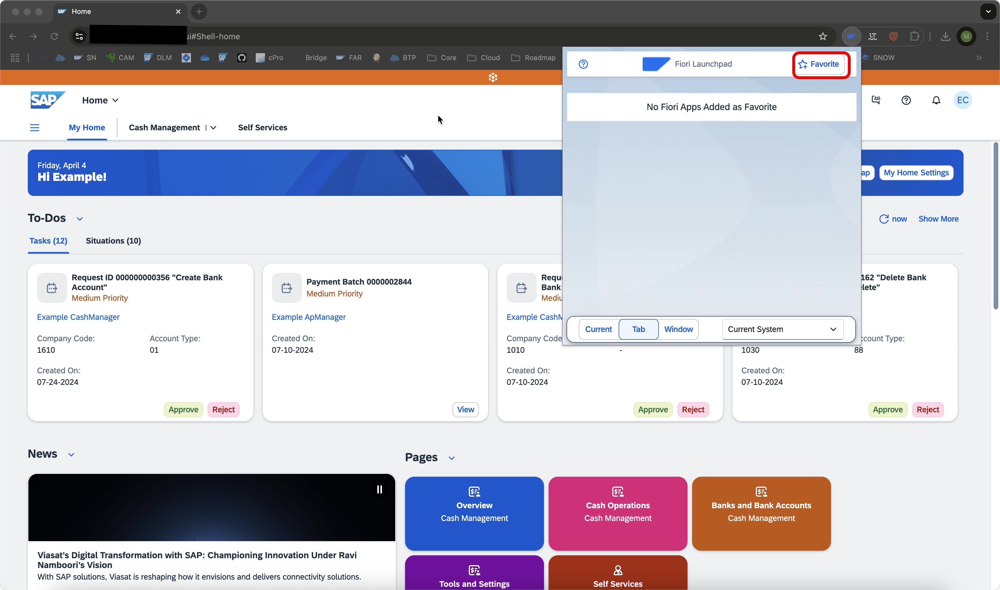
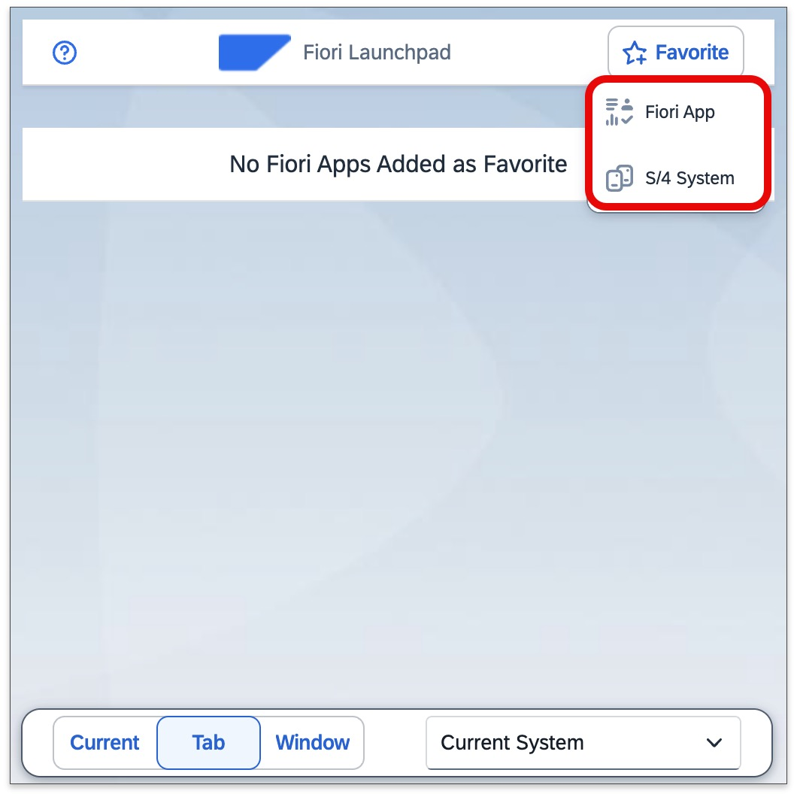
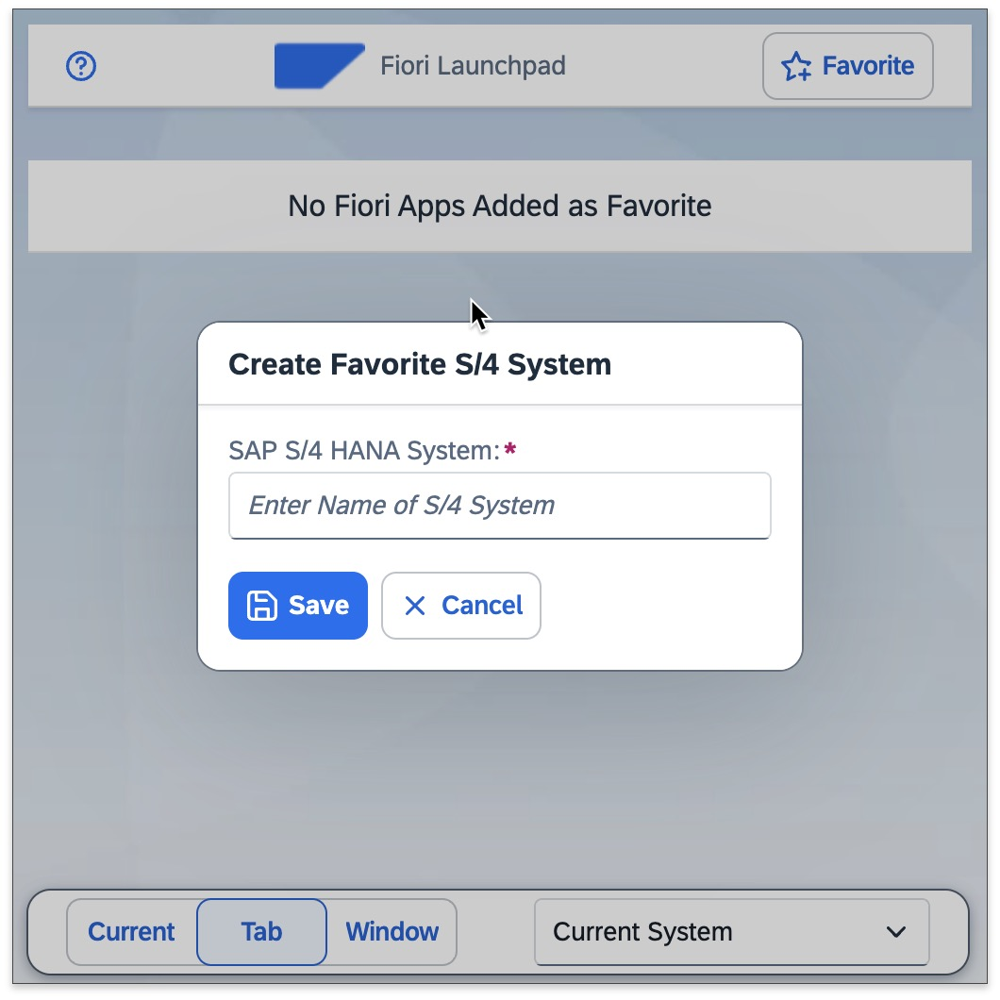

Newly added S/4HANA Systems will be visible in the drop down list on your popup. 

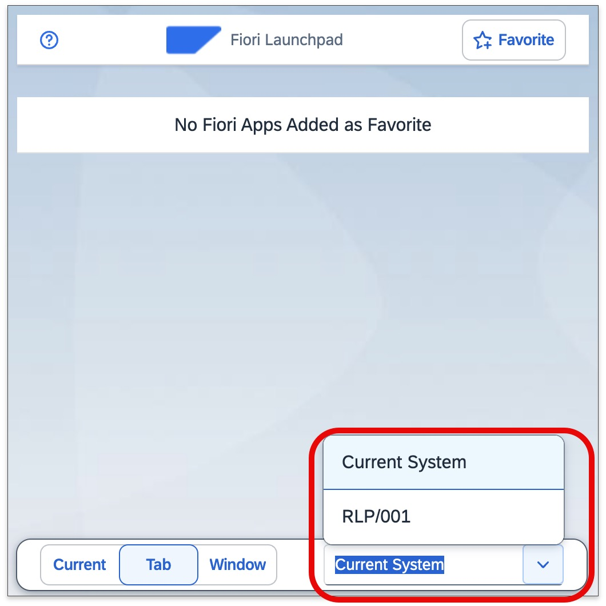

If you add a Fiori App to your favorite list, it will show up in your popup as well. This is basically a "dynamic" bookmark, you can open this fiori app, in any S/4HANA System.

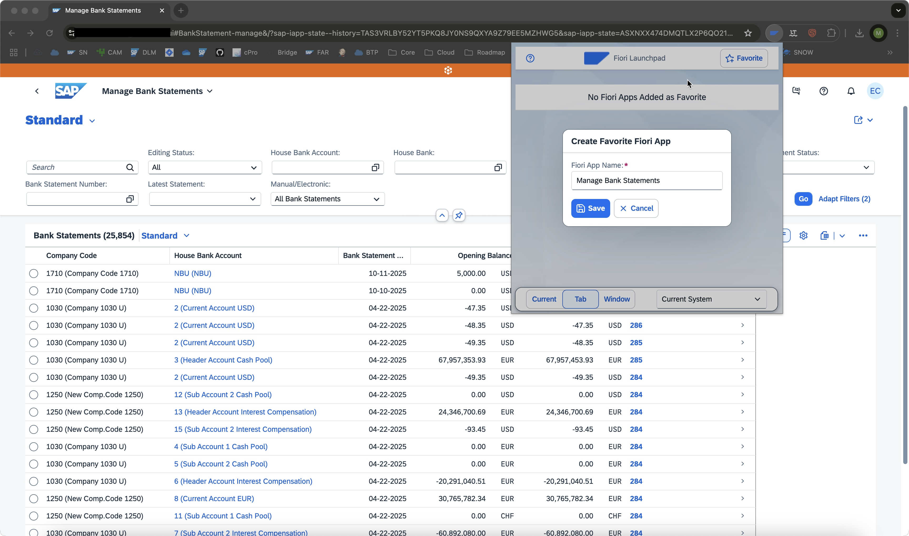

Now you can easily combine both, your favorite S/4HANA System and your favorite Fiori Apps. If you have "Current System" selected. It will navigate in the System, you currently have open in your browser.

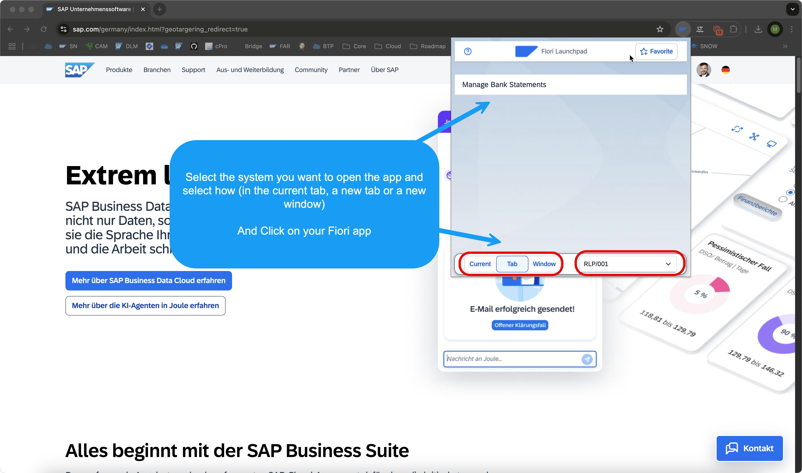

### Options

By right clicking on the extension icon and navigating to the Options page. You can configure your extension and maintain and mange your favorite lists, but also share your lists with other colleagues or clients.

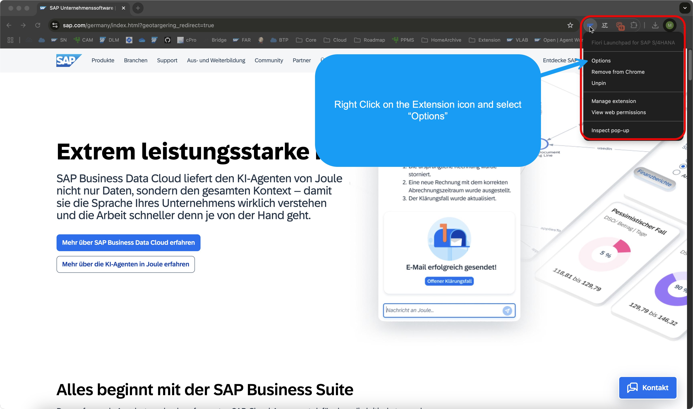

On the top left corner we have three buttons (segmented buttons). With the labels 'Current', 'Tab', 'Window'. These are the same settings you do also see on the popover, which opens from the extension logo. With this setting you define how you wish, to open the fiori app. 
* 'Current' means it stays in the current browser and tab, and will navigate to it.
* 'Tab' means it will open the new site in a new tab.
* 'Window' means accordingly, it will open in a new browser window.

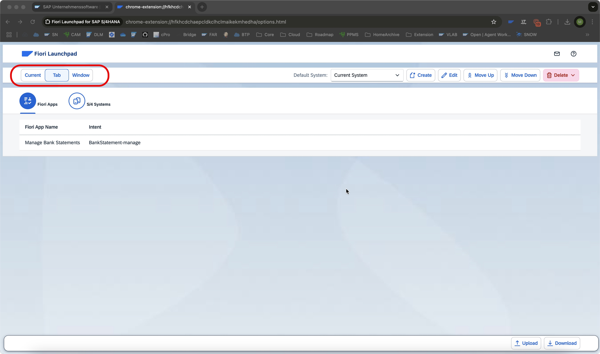

The system, which is always pre-selected in the popover in your drop down list. Can be set here as well. Just pick the system, you use the most.

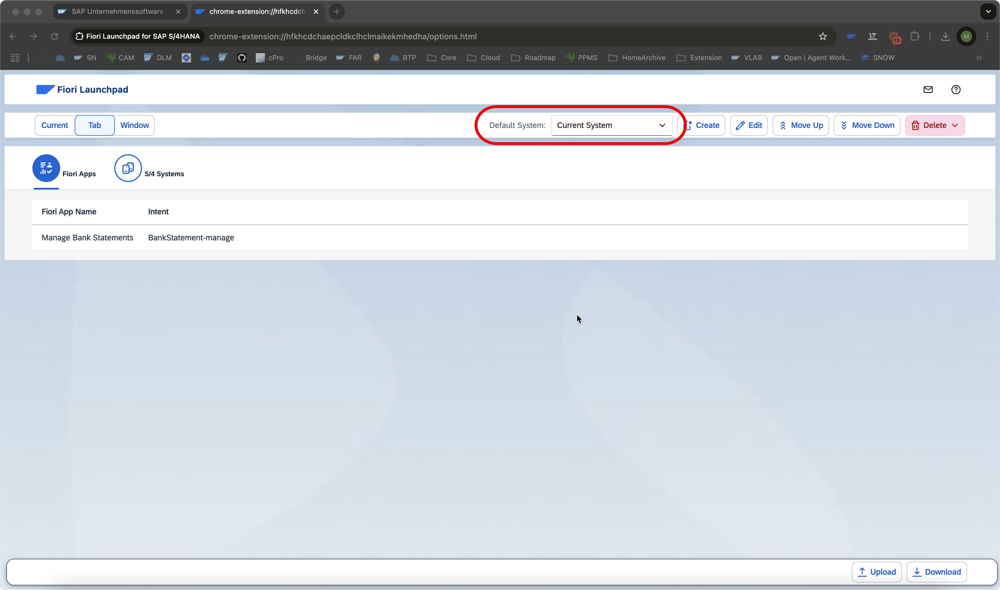

On the bottom right you have an upload and download functionality. With this feature you can share your lists to other colleagues or clients or keep them as a backup, if you switch your computer. Keep in mind you have to pre-select the correct table tab. You can't upload fiori apps into your extension, when the S/4 Systems tab is selected and vice versa. A bit below the three segmented buttons for the browser settings. You have two table tabs. One with 'Fiori Apps' and one with 'S/4 Systems' as label. With this you can change the view on your favorite lists. 

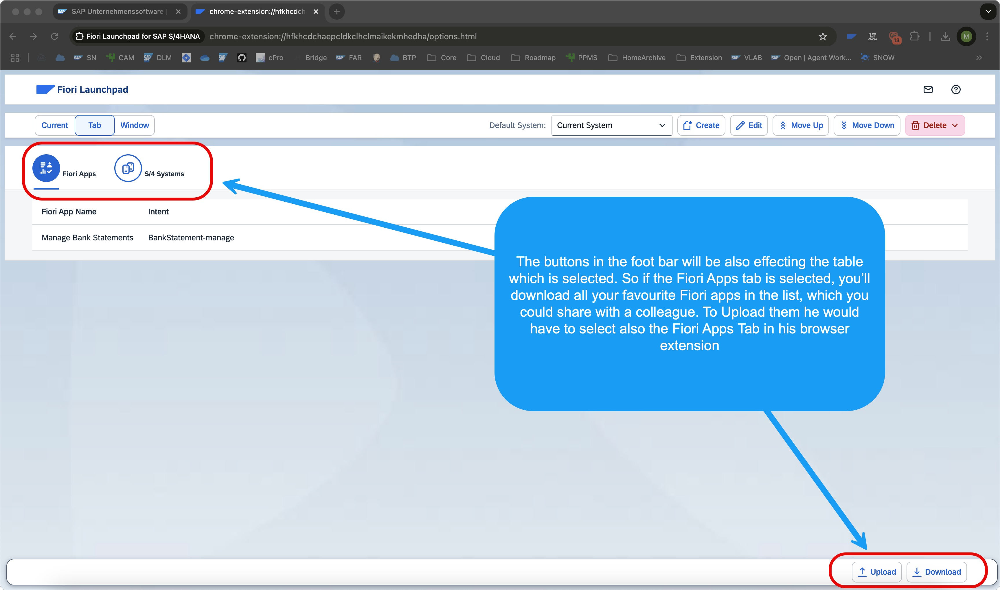

By the way one small hidden gem: if you want to use the extension also in your incognito window, you have to enable this in the extension settings of your browser. 

Click on the three dots, then on Settings. 

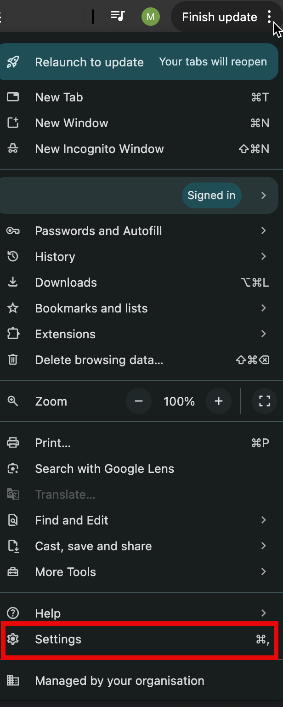

Navigate to the Extension settings:

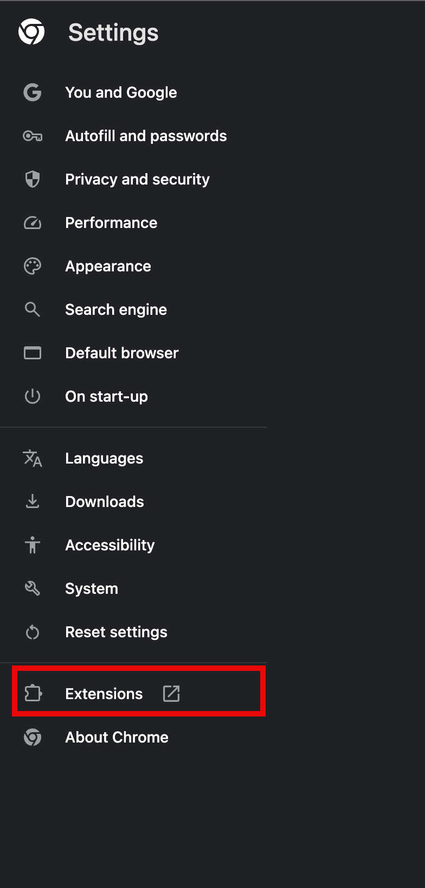

Almost there! Click on "Details".

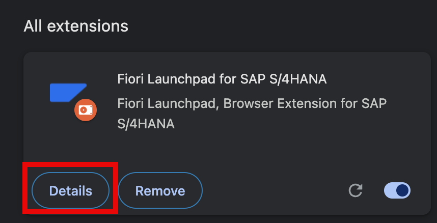

Now click on the switch button to enable the extension also for the incognito mode:

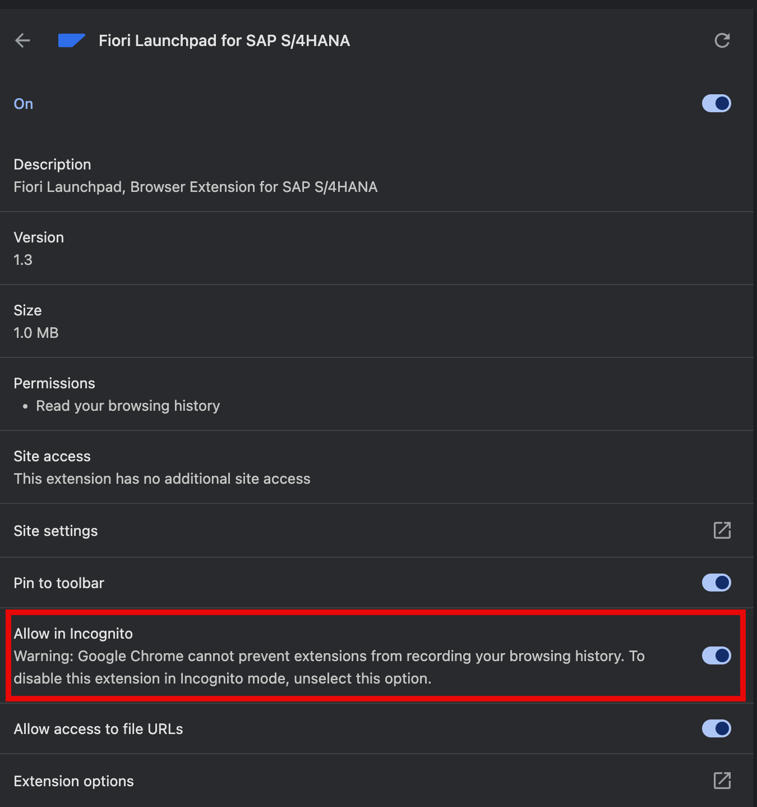

For any other questions you can either open a GitHub issue or comment on my [blog post](https://community.sap.com/t5/technology-blogs-by-sap/free-browser-extension-for-sap-s-4hana-for-increased-productivity-and/ba-p/13801414).

## Built With

[![nodejs][nodejs]][nodejs-url] 
[![UI5][ui5-wc]][ui5wc-url]
[![Webpack][webpack]][webpack-url]
[![Puppeteer][puppeteer]][puppeteer-url]

## Contact

Fiori Launchpad Extension is maintained by Edrilan Berisha.

Contributions of any kind are highly appreciated - improvement ideas, bug reports, or feature requests.
If you want to help, just contact me or open a GitHub issue.

 

 
Edrilan Berisha - fiorilaunchpad@gmx.de  

[ui5-wc]: imagesReadMe/ui5logo.png
[ui5wc-url]: https://sap.github.io/ui5-webcomponents/
[puppeteer]: imagesReadMe/puppeteerlogo.png
[puppeteer-url]: https://github.com/puppeteer/puppeteer
[webpack]: imagesReadMe/webpacklogo.png
[webpack-url]: https://webpack.js.org/
[nodejs]: imagesReadMe/nodejslogo.png
[nodejs-url]: https://nodejs.org/en/
[introPicture]: imagesReadMe/introPic.png
[gitHub]: imagesReadMe/githubIcon.png
[linkedIn]: imagesReadMe/linkedInIcon.webp
[linkedIn-url]: https://www.linkedin.com/in/edrilan-berisha/
